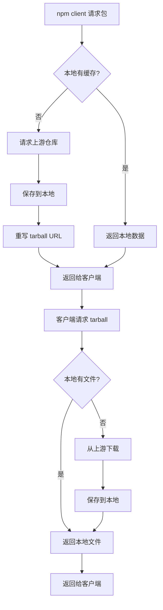
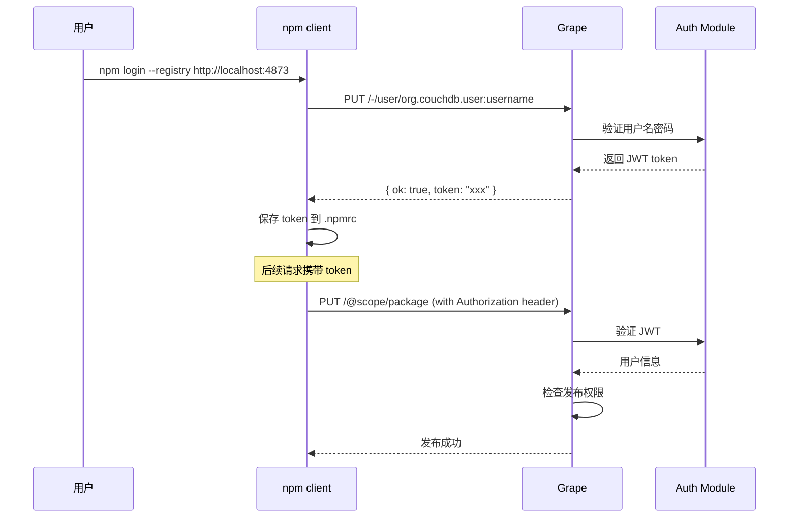
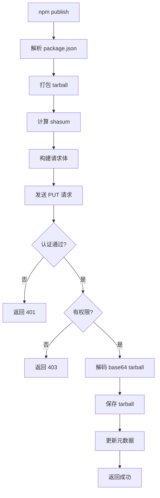
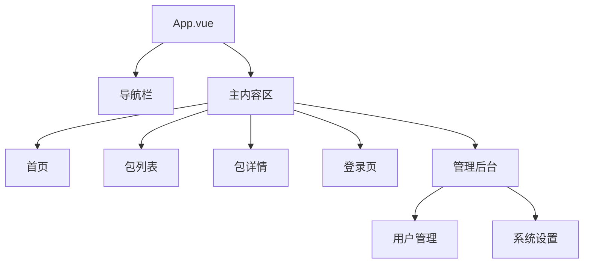
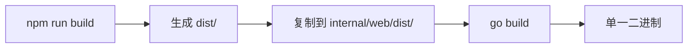

# 核心功能实现说明

## 项目架构

```
grape/
├── cmd/grape/main.go           # 程序入口
├── internal/
│   ├── api/                    # API 封装
│   ├── auth/                   # 认证模块
│   ├── config/                 # 配置管理
│   ├── logger/                 # 日志系统
│   ├── registry/               # npm registry 核心
│   ├── server/                 # HTTP 服务器
│   │   └── handler/            # 请求处理器
│   ├── storage/local/          # 本地存储
│   └── web/                    # 前端嵌入
├── web/                        # 前端源码
├── configs/                    # 配置文件
├── docs/                       # 文档
└── bin/                        # 编译产物
```

---

## 1. npm Registry 代理缓存

### 功能概述

Grape 作为 npm registry 代理，能够：
1. 代理公共 npm 仓库请求
2. 缓存包元数据和 tarball 文件
3. 重写 tarball URL 指向本地服务器

### 实现流程



### 关键文件

| 文件 | 说明 |
|------|------|
| `internal/registry/proxy.go` | 上游代理请求 |
| `internal/registry/errors.go` | 错误定义 |
| `internal/storage/local/storage.go` | 本地存储实现 |
| `internal/server/handler/registry.go` | HTTP 处理器 |

### 存储结构

```
data/
└── packages/
    ├── lodash/
    │   ├── metadata.json      # 包元数据
    │   └── tarballs/
    │       └── lodash-4.17.21.tgz
    └── @babel/
        └── core/
            ├── metadata.json
            └── tarballs/
                └── core-7.23.0.tgz
```

---

## 2. 用户认证系统

### 认证流程



### 关键文件

| 文件 | 说明 |
|------|------|
| `internal/auth/user.go` | 用户模型和内存存储 |
| `internal/auth/jwt.go` | JWT 生成和验证 |
| `internal/auth/middleware.go` | Gin 认证中间件 |

### JWT 结构

```json
{
  "sub": "username",
  "iss": "grape",
  "iat": 1708915200,
  "exp": 1709001600,
  "role": "admin"
}
```

### 默认账户

- 用户名: `admin`
- 密码: `admin`

---

## 3. 包发布流程

### 发布流程图



### 关键文件

| 文件 | 说明 |
|------|------|
| `internal/server/handler/publish.go` | 发布处理器 |
| `internal/storage/local/storage.go` | 文件存储 |

---

## 4. 前端架构

### 技术栈

| 技术 | 版本 | 说明 |
|------|------|------|
| Vite | 7.x | 构建工具 |
| Vue | 3.x | 前端框架 |
| TypeScript | 5.x | 类型支持 |
| Element Plus | 最新 | UI 组件库 |
| Pinia | 最新 | 状态管理 |
| Vue Router | 4.x | 路由管理 |

### 页面结构



### 关键文件

| 文件 | 说明 |
|------|------|
| `web/src/main.ts` | 入口文件 |
| `web/src/App.vue` | 根组件 |
| `web/src/router/index.ts` | 路由配置 |
| `web/src/stores/user.ts` | 用户状态 |
| `web/src/api/index.ts` | API 封装 |

---

## 5. 静态资源嵌入

### 实现方式

使用 Go 1.16+ 的 `embed` 包将前端静态资源嵌入二进制：

```go
//go:embed all:dist
var distFS embed.FS
```

### 关键文件

| 文件 | 说明 |
|------|------|
| `internal/web/embed.go` | 嵌入定义 |
| `internal/server/server.go` | 静态文件服务 |

### 构建流程



---

## 6. API 端点

### npm Registry API

| 端点 | 方法 | 说明 |
|------|------|------|
| `/:package` | GET | 获取包元数据 |
| `/:package/-/:filename` | GET | 下载 tarball |
| `/:package` | PUT | 发布包 |
| `/:package` | DELETE | 删除包 |
| `/-/user/:username` | PUT | 用户登录 |

### 管理 API

| 端点 | 方法 | 说明 |
|------|------|------|
| `/-/health` | GET | 健康检查 |
| `/-/api/packages` | GET | 包列表 |
| `/-/api/stats` | GET | 统计信息 |
| `/-/api/search` | GET | 搜索包 |
| `/-/api/user` | GET | 当前用户 |
| `/-/api/admin/users` | GET/POST/DELETE | 用户管理 |

---

## 7. 配置说明

### 配置文件 (configs/config.yaml)

```yaml
server:
  host: "0.0.0.0"
  port: 4873
  read_timeout: 30s
  write_timeout: 30s

registry:
  upstream: "https://registry.npmjs.org"

storage:
  type: "local"
  path: "./data"

auth:
  jwt_secret: "your-secret-key"
  jwt_expiry: 24h

log:
  level: "info"
```

### 环境变量

| 变量 | 说明 | 默认值 |
|------|------|--------|
| `GRAPE_SERVER_PORT` | 服务端口 | 4873 |
| `GRAPE_STORAGE_PATH` | 存储路径 | ./data |
| `GRAPE_JWT_SECRET` | JWT 密钥 | 随机生成 |