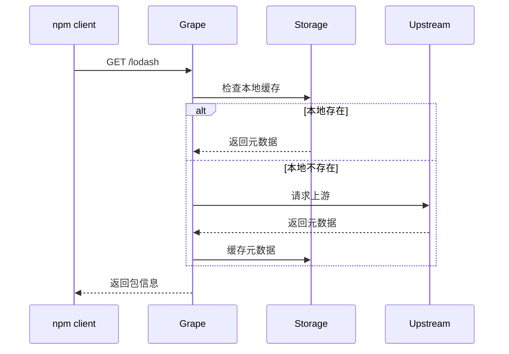
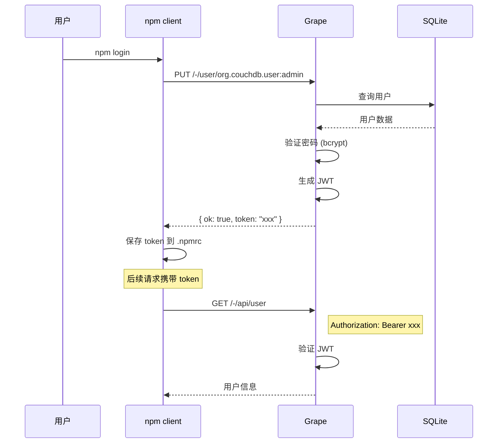
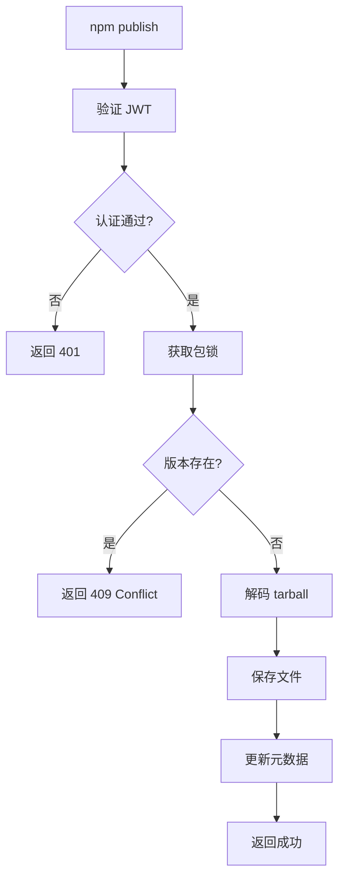
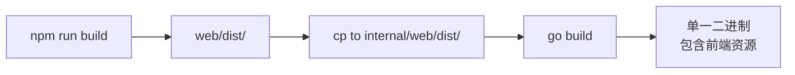

# 核心功能实现说明

## 项目架构

```
grape/
├── cmd/grape/main.go           # 程序入口
├── internal/
│   ├── auth/                   # 认证模块
│   │   ├── user.go             # 用户模型
│   │   ├── db_user.go          # 数据库用户存储
│   │   ├── jwt.go              # JWT 服务
│   │   └── middleware.go       # 认证中间件
│   ├── config/                 # 配置管理
│   ├── db/                     # 数据库
│   │   ├── db.go               # 数据库初始化
│   │   └── models.go           # GORM 模型
│   ├── logger/                 # 日志系统
│   ├── registry/               # npm registry 核心
│   │   ├── proxy.go            # 多上游代理
│   │   └── errors.go           # 错误定义
│   ├── server/                 # HTTP 服务器
│   │   ├── server.go           # 服务器主逻辑
│   │   └── handler/            # 请求处理器
│   ├── storage/                # 存储抽象
│   │   ├── storage.go          # 接口定义
│   │   └── local/              # 本地存储实现
│   └── web/                    # 前端嵌入
├── pkg/apierr/                 # 统一错误码
├── web/                        # 前端源码
├── configs/                    # 配置文件
└── docs/                       # 文档
```

---

## 1. 多上游代理系统

### 功能概述

Grape 支持配置多个上游 npm 仓库，并按包的 scope 自动路由：

- 自动识别 scoped 包 (`@scope/name`)
- 按 scope 配置路由到不同上游
- 支持启用/禁用上游
- 独立超时配置

### 实现流程

```mermaid
flowchart TD
    A[npm 请求包] --> B[提取 scope]
    B --> C{scope 匹配?}
    C -->|@company| D[company-private 上游]
    C -->|@internal| E[internal-tools 上游]
    C -->|其他| F[默认上游 npmjs]
    
    D --> G{本地缓存?}
    E --> G
    F --> G
    
    G -->|是| H[返回缓存数据]
    G -->|否| I[请求上游]
    I --> J[保存缓存]
    J --> H
```

### 关键代码

```go
// internal/registry/proxy.go

// selectUpstream 根据包名选择上游
func (p *Proxy) selectUpstream(packageName string) *Upstream {
    // 检查是否为 scoped 包
    if strings.HasPrefix(packageName, "@") {
        idx := strings.Index(packageName, "/")
        if idx > 0 {
            scope := packageName[:idx]  // 如 @company
            if up, ok := p.scopeMap[scope]; ok {
                return up  // 返回匹配的上游
            }
        }
    }
    return p.defaultUp  // 返回默认上游
}
```

### 配置示例

```yaml
registry:
  upstreams:
    - name: "npmjs"
      url: "https://registry.npmjs.org"
      scope: ""
      enabled: true
    
    - name: "company"
      url: "https://npm.company.com"
      scope: "@company"
      enabled: true
```

---

## 2. npm Registry 代理缓存

### 存储结构

```
data/
├── grape.db                    # SQLite 数据库
└── packages/
    ├── lodash/
    │   ├── metadata.json       # 包元数据
    │   └── tarballs/
    │       └── lodash-4.17.21.tgz
    └── @babel/
        └── core/
            ├── metadata.json
            └── tarballs/
                └── core-7.23.0.tgz
```

### 请求处理流程



### 存储接口

```go
// internal/storage/storage.go

type Storage interface {
    HasPackage(name string) bool
    GetMetadata(name string) ([]byte, error)
    SaveMetadata(name string, data []byte) error
    DeletePackage(name string) error
    
    HasTarball(name, filename string) bool
    GetTarball(name, filename string) ([]byte, error)
    SaveTarball(name, filename string, data []byte) error
    DeleteTarball(name, filename string) error
    
    ListPackages() ([]PackageInfo, error)
    GetStats() (*StorageStats, error)
}
```

---

## 3. 用户认证系统

### 数据库模型

```go
// internal/db/models.go

type User struct {
    ID        uint       `gorm:"primaryKey"`
    Username  string     `gorm:"uniqueIndex"`
    Email     string
    Password  string     // bcrypt 哈希
    Role      string     // admin | developer
    CreatedAt time.Time
    LastLogin *time.Time
}
```

### 认证流程



### 登录限流

```go
// internal/server/handler/auth.go

// 检查登录限流（每 IP 每分钟最多 10 次）
if !getLoginLimiter().checkLimit(clientIP) {
    c.JSON(http.StatusTooManyRequests, gin.H{
        "error": "too many login attempts",
    })
    return
}
```

---

## 4. 包发布流程

### 并发安全保护

```go
// internal/server/handler/publish.go

type PublishHandler struct {
    storage *local.Storage
    locks   sync.Map  // 包名 -> *sync.Mutex
}

// 获取包级别的互斥锁
func (h *PublishHandler) getPackageLock(name string) *sync.Mutex {
    mu, _ := h.locks.LoadOrStore(name, &sync.Mutex{})
    return mu.(*sync.Mutex)
}

func (h *PublishHandler) Publish(c *gin.Context) {
    // 获取包级别锁
    lock := h.getPackageLock(packageName)
    lock.Lock()
    defer lock.Unlock()
    
    // 检查版本是否已存在
    // 保存 tarball
    // 更新元数据
}
```

### 发布流程



---

## 5. 前端架构

### 技术栈

| 技术 | 版本 | 说明 |
|------|------|------|
| Vite | 7.x | 构建工具 |
| Vue | 3.x | 前端框架 |
| TypeScript | 5.x | 类型支持 |
| Element Plus | 最新 | UI 组件库 |
| Pinia | 最新 | 状态管理 |
| Vue Router | 4.x | 路由管理 |

### 状态管理

```typescript
// web/src/stores/user.ts

export const useUserStore = defineStore('user', {
  state: () => ({
    username: localStorage.getItem('username'),
    token: localStorage.getItem('token'),
    role: null,
  }),
  
  actions: {
    async login(username: string, password: string) {
      const res = await authApi.login(username, password)
      this.token = res.data.token
      this.username = username
      localStorage.setItem('token', this.token)
    },
    
    logout() {
      this.token = null
      this.username = null
      localStorage.removeItem('token')
    },
  },
})
```

### API 拦截器

```typescript
// web/src/api/index.ts

// Request interceptor - 注入 JWT token
api.interceptors.request.use((config) => {
  const token = localStorage.getItem('token')
  if (token) {
    config.headers.Authorization = `Bearer ${token}`
  }
  return config
})

// Response interceptor - 处理 401 自动跳转
api.interceptors.response.use(
  (response) => response,
  (error) => {
    if (error.response?.status === 401) {
      localStorage.removeItem('token')
      localStorage.removeItem('username')
      router.push('/login')
    }
    return Promise.reject(error)
  }
)
```

---

## 6. 静态资源嵌入

### 实现方式

```go
// internal/web/embed.go

//go:embed all:dist
var distFS embed.FS

func GetDistFS() fs.FS {
    f, _ := fs.Sub(distFS, "dist")
    return f
}
```

### 构建流程



### Makefile

```makefile
build: frontend
	go build -o ./bin/grape ./cmd/grape

frontend:
	cd web && npm run build
	cp -r web/dist internal/web/
```

---

## 7. 统一错误码

### 错误码定义

```go
// pkg/apierr/errors.go

var (
    ErrBadRequest       = &APIError{Code: 4000, Message: "bad request"}
    ErrUnauthorized     = &APIError{Code: 4010, Message: "authentication required"}
    ErrForbidden        = &APIError{Code: 4030, Message: "insufficient permissions"}
    ErrNotFound         = &APIError{Code: 4040, Message: "resource not found"}
    ErrPackageNotFound  = &APIError{Code: 4041, Message: "package not found"}
    ErrConflict         = &APIError{Code: 4090, Message: "resource conflict"}
    ErrVersionExists    = &APIError{Code: 4091, Message: "version already exists"}
    ErrRateLimited      = &APIError{Code: 4290, Message: "too many requests"}
    ErrInternal         = &APIError{Code: 5000, Message: "internal server error"}
)
```

### 响应格式

```json
{
  "code": 4041,
  "message": "package not found",
  "reason": "@company/private-pkg"
}
```

---

## 8. API 端点总览

### 公开 API

| 端点 | 方法 | 说明 |
|------|------|------|
| `/-/health` | GET | 健康检查 |
| `/:package` | GET | 获取包元数据 |
| `/:package/-/:filename` | GET | 下载 tarball |
| `/-/user/:username` | PUT | 登录/注册 |

### 认证 API

| 端点 | 方法 | 说明 |
|------|------|------|
| `/-/api/user` | GET | 当前用户信息 |
| `/-/api/session` | DELETE | 登出 |
| `/-/api/packages` | GET | 包列表 |
| `/-/api/stats` | GET | 统计信息 |
| `/-/api/upstreams` | GET | 上游配置 |
| `/-/api/search` | GET | 搜索包 |

### 管理员 API

| 端点 | 方法 | 说明 |
|------|------|------|
| `/-/api/admin/users` | GET | 用户列表 |
| `/-/api/admin/users` | POST | 创建用户 |
| `/-/api/admin/users/:name` | DELETE | 删除用户 |
