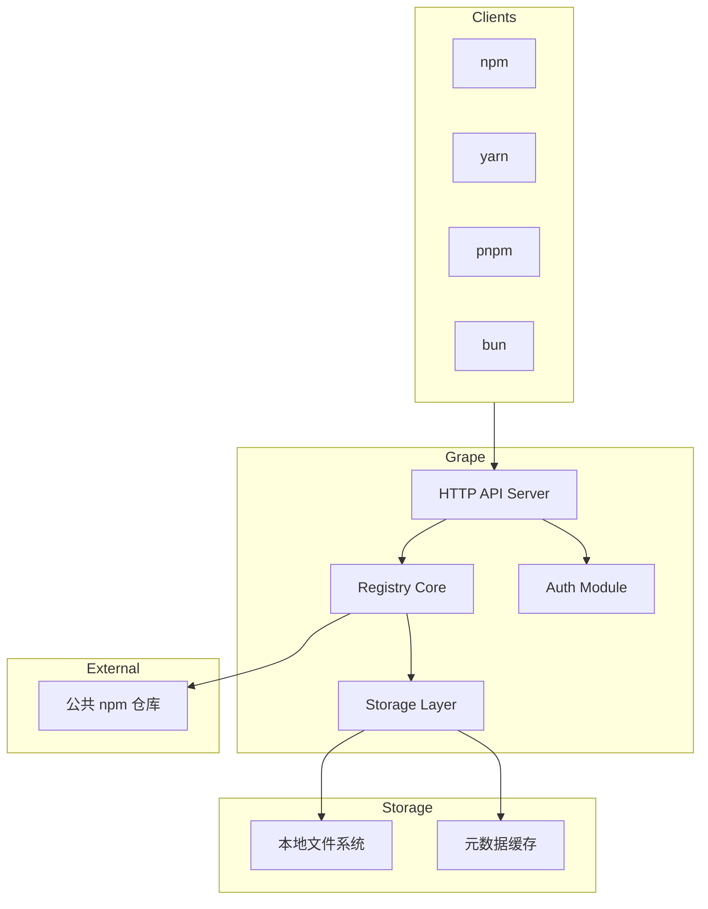
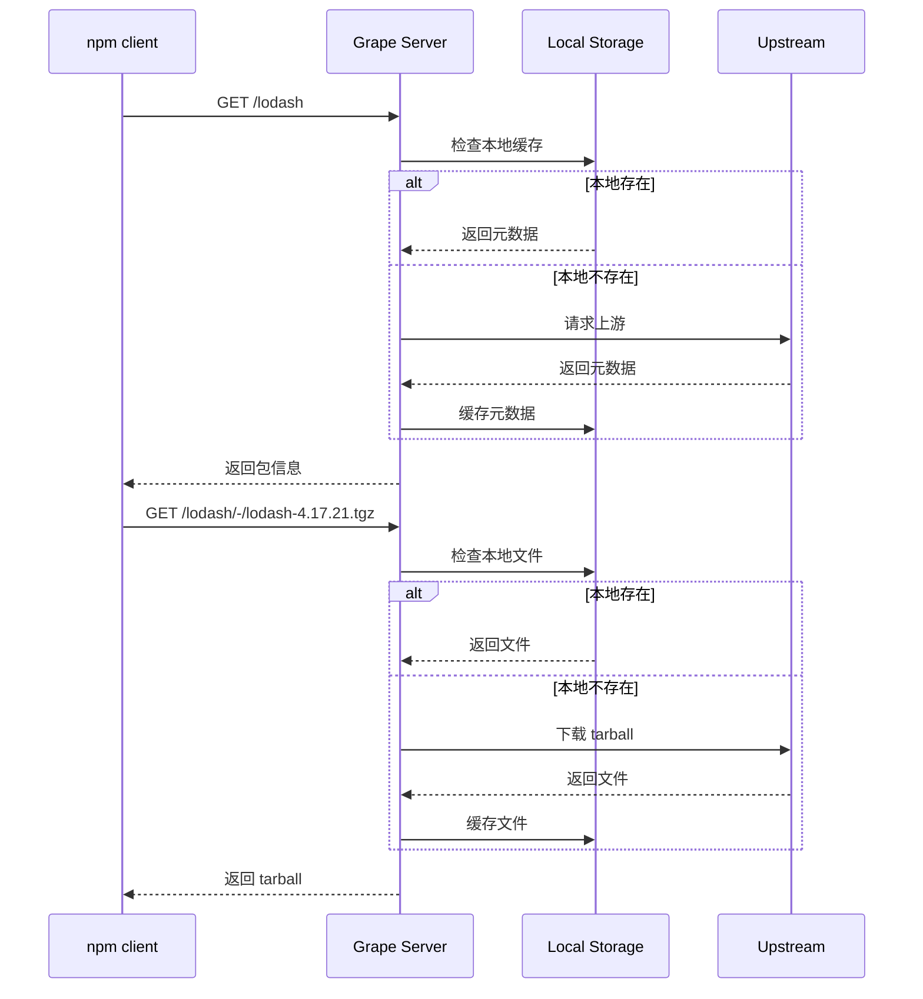

# Grape 开发文档

> 🍇 Grape - 轻盈如风的企业级私有 npm 仓库

## 目录

- [项目概述](#项目概述)
- [技术架构](#技术架构)
- [开发路线图](#开发路线图)
- [快速开始](#快速开始)
- [模块说明](#模块说明)

---

## 项目概述

### 愿景

Grape 旨在打造一个**极致轻量、企业就绪**的私有 npm 仓库。用 Go 重写，在保持完美兼容 npm/yarn/pnpm/bun 客户端的同时，提供比 Verdaccio 更强大的权限控制、更现代化的 Web 界面、更低的资源占用。

### 核心特性

| 特性 | 说明 |
|------|------|
| 单一二进制 | 无需安装 Node.js，下载即用 |
| 低内存占用 | < 5MB，远低于 Verdaccio (~20MB) |
| 智能代理 | 自动缓存公共包，加速团队开发 |
| 权限控制 | RBAC 模型，精细化权限管理 |
| 现代化 UI | Vue 3 + Element Plus |

### 与 Verdaccio 对比

| 维度 | Grape | Verdaccio |
|------|-------|-----------|
| 技术栈 | Go | Node.js |
| 内存占用 | < 5MB | ~ 20MB |
| 并发能力 | 高 (goroutine) | 中 (单线程) |
| 权限模型 | RBAC + Web 管理 | 简单 ACL + 配置文件 |
| Web UI | Vue 3 + Element Plus | 内置简单 UI |

---

## 技术架构

### 整体架构



### 请求处理流程



### 技术栈

| 组件 | 技术选型 | 说明 |
|------|----------|------|
| 后端语言 | Go 1.21+ | 高性能、并发、单一二进制 |
| Web 框架 | Gin | 高性能、中间件丰富 |
| 配置管理 | Viper | 支持多种配置格式 |
| 日志 | Zap | 高性能结构化日志 |
| 认证 | JWT | 无状态认证 |
| 前端框架 | Vue 3 + TypeScript | 现代化响应式框架 |
| UI 组件 | Element Plus | Vue 3 组件库 |
| 状态管理 | Pinia | Vue 3 官方状态管理 |
| 构建工具 | Vite | 极速开发体验 |

---

## 开发路线图

### 阶段一：基础框架 (已完成 ✅)

- [x] Go 项目骨架搭建
- [x] Viper 配置管理 + Zap 日志
- [x] Gin Web 框架 + 基础路由
- [x] 健康检查 API
- [x] npm 包元数据代理
- [x] tarball 下载代理
- [x] 本地缓存机制
- [x] 验证：npm install 成功

### 阶段二：发布能力 (进行中 🚧)

- [ ] 用户认证基础（内存用户 + JWT）
- [ ] npm login 流程
- [ ] npm publish 发布包
- [ ] npm unpublish 撤销发布
- [ ] 验证：发布私有包成功

### 阶段三：前端完善 (已完成 ✅)

- [x] Vite + Vue 3 + TypeScript 项目
- [x] 登录页面
- [x] 包浏览页面
- [x] 包详情页面
- [x] 用户管理页面
- [x] 系统设置页面

### 阶段四：集成部署 (待开始)

- [ ] Go 嵌入前端静态资源
- [ ] 单一二进制部署
- [ ] Docker 镜像

---

## 快速开始

### 环境要求

- Go 1.21+
- Node.js 18+ (仅前端开发需要)

### 后端启动

```bash
# 构建
make build

# 运行
./bin/grape

# 或使用配置文件
./bin/grape -c ./configs/config.yaml
```

### 前端启动

```bash
cd web
npm install
npm run dev
```

### 配置 npm 使用 Grape

```bash
# 设置 registry
npm set registry http://localhost:4873

# 安装包
npm install lodash

# 恢复默认
npm set registry https://registry.npmjs.org
```

---

## 模块说明

| 模块 | 路径 | 职责 |
|------|------|------|
| config | `internal/config/` | 配置加载和管理 |
| logger | `internal/logger/` | 日志封装 |
| server | `internal/server/` | HTTP 服务器和路由 |
| registry | `internal/registry/` | npm registry 核心逻辑 |
| storage | `internal/storage/` | 存储抽象层 |
| web | `web/` | 前端项目 |

详细模块文档请参阅各子目录下的 README。
