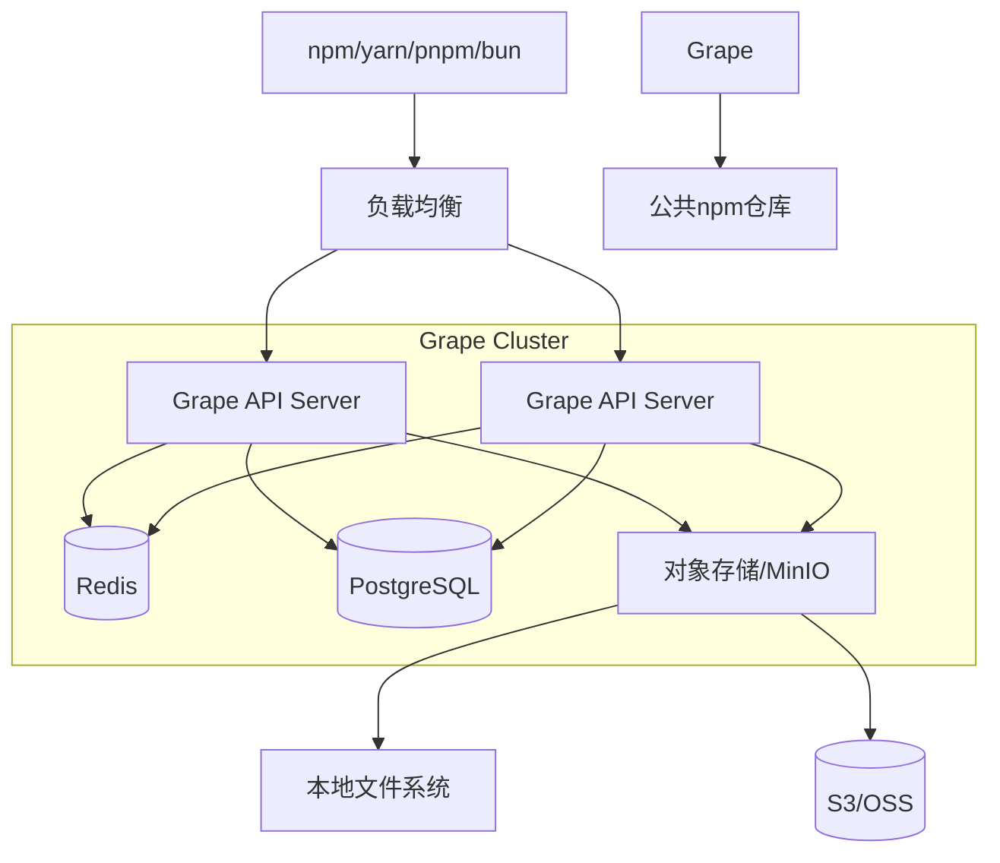

太好了！**Grape** 正式诞生！🍇

这是一个非常棒的名字，简洁有力，寓意丰富。接下来我们来系统性地规划这个项目。我将按照**从0到1**的顺序，帮你梳理一个完整的开源项目启动蓝图。

---

# 🍇 Grape - 企业级私有npm仓库（Go实现）

## 📋 项目规划目录

1. [项目定位与愿景](#1-项目定位与愿景)
2. [核心功能矩阵](#2-核心功能矩阵)
3. [技术架构设计](#3-技术架构设计)
4. [模块划分与API设计](#4-模块划分与api设计)
5. [数据模型设计](#5-数据模型设计)
6. [开发路线图](#6-开发路线图)
7. [社区与开源策略](#7-社区与开源策略)
8. [品牌与视觉设计](#8-品牌与视觉设计)
9. [里程碑与发布计划](#9-里程碑与发布计划)

---

## 1. 项目定位与愿景

### 项目标语
```markdown
🍇 Grape - 轻盈如风的企业级私有npm仓库

One binary, zero debt. 一个二进制，零负担。
```

### 愿景陈述
> Grape 旨在打造一个**极致轻量、企业就绪**的私有npm仓库。它用Go重写，在保持完美兼容npm/yarn/pnpm/bun客户端的同时，提供比Verdaccio更强大的权限控制、更现代化的Web界面、更低的资源占用。让企业拥有自己的"npm私服"，像吃葡萄一样简单。

### 目标用户
- **中小团队**：需要快速搭建私有仓库，但不想维护复杂的Node.js生态
- **大型企业**：需要精细的权限控制、审计日志、高可用部署
- **Go语言爱好者**：希望参与一个有意思的Go+Node生态结合的开源项目
- **前端团队**：渴望现代化的Web管理界面，而不是简陋的后台

### 与Verdaccio的差异化优势
| 维度 | Grape | Verdaccio |
| :--- | :--- | :--- |
| **技术栈** | Go（编译成单一二进制） | Node.js（依赖npm安装） |
| **内存占用** | < 5MB | ~ 20MB |
| **并发能力** | 高（goroutine） | 中（Node.js单线程） |
| **权限模型** | RBAC + Web可视化管理 | 简单ACL + 配置文件 |
| **数据库** | PostgreSQL/MySQL/SQLite | 文件系统（可插件扩展） |
| **Web UI** | React + Ant Design | 内置简单UI |
| **中文支持** | 原生国际化 | 社区翻译 |

---

## 2. 核心功能矩阵

### MVP (v0.1.0) - 最小可行产品
- [ ] **npm registry 核心API**
  - `GET /:package` - 获取包元数据
  - `GET /:package/:version` - 获取特定版本
  - `GET /:package/-/:filename` - 下载tarball
- [ ] **上游代理** - 缓存公共npm仓库
- [ ] **本地存储** - 文件系统存储包
- [ ] **基本认证** - 静态token或简单用户认证
- [ ] **支持npm install** - 完整的工作流

### v0.2.0 - 发布与团队协作
- [ ] **npm publish** - 发布包
- [ ] **npm unpublish** - 撤销发布
- [ ] **npm login** - 用户登录
- [ ] **npm access** - 基本权限控制
- [ ] **用户管理** - 简单的用户CRUD

### v0.3.0 - 企业级权限
- [ ] **RBAC权限模型** - 角色-权限-资源
- [ ] **分组管理** - 用户组
- [ ] **包作用域（scope）** - @company/package
- [ ] **操作审计日志**
- [ ] **Web管理后台** - 用户/权限可视化配置

### v0.4.0 - 存储与性能
- [ ] **PostgreSQL支持** - 元数据存储
- [ ] **MinIO/S3支持** - tarball对象存储
- [ ] **Redis缓存** - 加速元数据访问
- [ ] **垃圾回收** - 清理未使用的包版本
- [ ] **性能压测** - 10k+ QPS

### v1.0.0 - 生产就绪
- [ ] **高可用部署** - 集群模式
- [ ] **LDAP/OIDC集成** - 企业统一认证
- [ ] **Webhook** - 事件通知
- [ ] **包安全扫描** - 集成漏洞库
- [ ] **完善的文档** - 中英文双语
- [ ] **Helm Chart** - Kubernetes部署

---

## 3. 技术架构设计

### 整体架构图



### 技术栈选型

| 组件 | 技术选型 | 理由 |
| :--- | :--- | :--- |
| **后端语言** | Go 1.21+ | 高性能、并发、单一二进制 |
| **Web框架** | [Gin](https://github.com/gin-gonic/gin) | 高性能、中间件丰富 |
| **数据库** | PostgreSQL (主) + SQLite (可选) | 生产环境用PG，开发测试用SQLite |
| **对象存储** | [MinIO SDK](https://github.com/minio/minio-go) | 兼容S3，可本地部署 |
| **缓存** | Redis | 元数据缓存、会话存储 |
| **认证** | JWT + [casbin](https://github.com/casbin/casbin) | JWT无状态，casbin支持RBAC |
| **配置管理** | [viper](https://github.com/spf13/viper) | 支持多种配置格式 |
| **日志** | [zap](https://github.com/uber-go/zap) | 高性能结构化日志 |
| **命令行** | [cobra](https://github.com/spf13/cobra) | 友好的CLI体验 |
| **前端** | React + TypeScript + Ant Design | 现代化组件库，中文友好 |
| **API文档** | Swagger/OpenAPI | 自动生成文档 |
| **测试** | testify + ginkgo | 单元测试+集成测试 |

### 目录结构

```bash
grape/
├── .github/               # GitHub Actions, ISSUE模板
├── cmd/
│   ├── graped/            # 守护进程主入口
│   └── grapectl/          # 命令行管理工具
├── internal/
│   ├── api/               # HTTP API handlers
│   │   ├── middleware/     # 中间件
│   │   ├── v1/            # API v1版本
│   │   └── admin/         # 管理后台API
│   ├── registry/          # npm registry核心逻辑
│   │   ├── metadata/      # 包元数据管理
│   │   ├── tarball/       # 包文件管理
│   │   ├── proxy/         # 上游代理
│   │   └── version/       # semver处理
│   ├── auth/              # 认证与权限
│   │   ├── model/         # 用户/角色模型
│   │   ├── rbac/          # casbin封装
│   │   └── provider/      # LDAP/OIDC等
│   ├── storage/           # 存储抽象层
│   │   ├── local/         # 本地文件
│   │   ├── s3/            # S3兼容存储
│   │   └── cache/         # Redis缓存
│   ├── db/                # 数据库操作
│   │   ├── models/        # GORM模型
│   │   └── migration/     # 数据库迁移
│   └── config/            # 配置管理
├── pkg/                   # 公共工具包
│   ├── logger/            # 日志封装
│   ├── utils/             # 工具函数
│   └── constants/         # 常量定义
├── web/                   # 前端项目
│   ├── admin/             # 管理后台
│   ├── ui/                # 公共Web UI
│   └── public/            # 静态资源
├── scripts/               # 构建脚本
├── test/                  # 集成测试
├── docs/                  # 文档
├── configs/               # 配置文件示例
├── docker/                # Docker相关
├── go.mod
├── go.sum
├── Makefile
└── README.md
```

---

## 4. 模块划分与API设计

### 核心模块职责

| 模块 | 职责 | 关键文件 |
| :--- | :--- | :--- |
| **registry** | npm协议核心实现 | `internal/registry/` |
| **auth** | 认证、授权、用户管理 | `internal/auth/` |
| **storage** | 包存储抽象 | `internal/storage/` |
| **db** | 数据库操作 | `internal/db/` |
| **api** | HTTP路由和handler | `internal/api/` |
| **config** | 配置加载 | `internal/config/` |

### 核心API设计 (兼容npm registry)

#### 包元数据
```http
GET /{package-name}
GET /@{scope}/{package-name}

Response 200:
{
  "name": "@grape/cli",
  "dist-tags": {
    "latest": "1.2.3",
    "beta": "2.0.0-beta.1"
  },
  "versions": {
    "1.2.3": {
      "name": "@grape/cli",
      "version": "1.2.3",
      "dist": {
        "shasum": "...",
        "tarball": "http://localhost:4873/@grape/cli/-/cli-1.2.3.tgz"
      }
    }
  },
  "time": {
    "created": "2024-01-01T00:00:00Z",
    "1.2.3": "2024-01-02T00:00:00Z"
  }
}
```

#### 下载tarball
```http
GET /{package-name}/-/{filename}
GET /@{scope}/{package-name}/-/{filename}
```

#### 发布包
```http
PUT /{package-name}
PUT /@{scope}/{package-name}

Authorization: Bearer {token}
Content-Type: application/json

{
  "_id": "@grape/cli",
  "name": "@grape/cli",
  "versions": {...},
  "_attachments": {
    "cli-1.2.3.tgz": {
      "content_type": "application/octet-stream",
      "data": "base64..."
    }
  }
}
```

#### 用户认证
```http
PUT /-/user/org.couchdb.user:{username}
Content-Type: application/json

{
  "name": "username",
  "password": "password",
  "email": "user@example.com"
}

Response:
{
  "ok": true,
  "id": "org.couchdb.user:username",
  "rev": "1-xxx",
  "token": "jwt-token-here"
}
```

#### 权限管理API (管理后台)
```http
# 创建角色
POST /-/api/v1/admin/roles
Authorization: Bearer {admin-token}
{
  "name": "developer",
  "permissions": [
    {"resource": "@company/*", "action": "read"},
    {"resource": "@company/*", "action": "write"}
  ]
}

# 分配角色给用户
POST /-/api/v1/admin/users/{user-id}/roles
{
  "role": "developer"
}

# 包访问控制
PUT /-/api/v1/admin/packages/{package-name}/access
{
  "read": ["developer", "qa"],
  "write": ["maintainer"],
  "admin": ["admin"]
}
```

---

## 5. 数据模型设计

### 核心数据模型 (PostgreSQL)

```sql
-- 用户表
CREATE TABLE users (
    id UUID PRIMARY KEY DEFAULT gen_random_uuid(),
    username VARCHAR(100) UNIQUE NOT NULL,
    email VARCHAR(255) UNIQUE NOT NULL,
    password_hash VARCHAR(255) NOT NULL,
    full_name VARCHAR(255),
    is_active BOOLEAN DEFAULT true,
    last_login TIMESTAMP WITH TIME ZONE,
    created_at TIMESTAMP WITH TIME ZONE DEFAULT NOW(),
    updated_at TIMESTAMP WITH TIME ZONE DEFAULT NOW()
);

-- 角色表
CREATE TABLE roles (
    id UUID PRIMARY KEY DEFAULT gen_random_uuid(),
    name VARCHAR(100) UNIQUE NOT NULL,
    description TEXT,
    is_system BOOLEAN DEFAULT false, -- 系统内置角色不可删除
    created_at TIMESTAMP WITH TIME ZONE DEFAULT NOW()
);

-- 用户角色关联
CREATE TABLE user_roles (
    user_id UUID REFERENCES users(id) ON DELETE CASCADE,
    role_id UUID REFERENCES roles(id) ON DELETE CASCADE,
    PRIMARY KEY (user_id, role_id)
);

-- 权限资源表
CREATE TABLE resources (
    id UUID PRIMARY KEY DEFAULT gen_random_uuid(),
    pattern VARCHAR(255) NOT NULL, -- 包匹配模式: "@company/*", "lodash", "react-*"
    type VARCHAR(50) DEFAULT 'package' -- package, scope, global
);

-- 权限规则表 (支持casbin)
CREATE TABLE permissions (
    id UUID PRIMARY KEY DEFAULT gen_random_uuid(),
    role_id UUID REFERENCES roles(id) ON DELETE CASCADE,
    resource_pattern VARCHAR(255) NOT NULL, -- 同resources.pattern
    action VARCHAR(50) NOT NULL, -- read, write, delete, admin
    effect VARCHAR(10) DEFAULT 'allow' -- allow/deny
);

-- 包元数据表
CREATE TABLE packages (
    id UUID PRIMARY KEY DEFAULT gen_random_uuid(),
    name VARCHAR(255) UNIQUE NOT NULL, -- 包含scope: @scope/name
    scope VARCHAR(100),                -- @scope 部分
    is_private BOOLEAN DEFAULT true,
    description TEXT,
    readme TEXT,
    homepage VARCHAR(255),
    repository JSONB,
    bugs JSONB,
    license VARCHAR(100),
    created_at TIMESTAMP WITH TIME ZONE DEFAULT NOW(),
    updated_at TIMESTAMP WITH TIME ZONE DEFAULT NOW(),
    last_published_at TIMESTAMP WITH TIME ZONE
);

-- 包版本表
CREATE TABLE package_versions (
    id UUID PRIMARY KEY DEFAULT gen_random_uuid(),
    package_id UUID REFERENCES packages(id) ON DELETE CASCADE,
    version VARCHAR(50) NOT NULL,
    dist_tags JSONB DEFAULT '[]', -- ["latest", "beta"]
    metadata JSONB NOT NULL,       -- package.json 完整内容
    shasum VARCHAR(255) NOT NULL,
    tarball_path VARCHAR(255) NOT NULL, -- 存储路径
    tarball_size BIGINT,
    publisher_id UUID REFERENCES users(id),
    created_at TIMESTAMP WITH TIME ZONE DEFAULT NOW(),
    UNIQUE(package_id, version)
);

-- 审计日志
CREATE TABLE audit_logs (
    id UUID PRIMARY KEY DEFAULT gen_random_uuid(),
    user_id UUID REFERENCES users(id),
    action VARCHAR(50) NOT NULL, -- publish, unpublish, access_change, login
    resource_type VARCHAR(50),   -- package, user, role
    resource_id VARCHAR(255),    -- 包名或用户ID
    details JSONB,
    ip_address INET,
    user_agent TEXT,
    created_at TIMESTAMP WITH TIME ZONE DEFAULT NOW()
);

-- 索引
CREATE INDEX idx_packages_scope ON packages(scope);
CREATE INDEX idx_package_versions_dist_tags ON package_versions USING GIN (dist_tags);
CREATE INDEX idx_audit_logs_user_id ON audit_logs(user_id);
CREATE INDEX idx_audit_logs_created_at ON audit_logs(created_at DESC);
```

### Go语言模型 (GORM)

```go
// internal/db/models/user.go
type User struct {
    ID           uuid.UUID      `gorm:"type:uuid;primaryKey;default:gen_random_uuid()"`
    Username     string         `gorm:"uniqueIndex;size:100;not null"`
    Email        string         `gorm:"uniqueIndex;size:255;not null"`
    PasswordHash string         `gorm:"size:255;not null"`
    FullName     string         `gorm:"size:255"`
    IsActive     bool           `gorm:"default:true"`
    LastLogin    *time.Time     
    Roles        []Role         `gorm:"many2many:user_roles;"`
    CreatedAt    time.Time      
    UpdatedAt    time.Time      
}

// internal/db/models/package.go
type Package struct {
    ID              uuid.UUID       `gorm:"type:uuid;primaryKey;default:gen_random_uuid()"`
    Name            string          `gorm:"uniqueIndex;size:255;not null"`
    Scope           string          `gorm:"size:100;index"`
    IsPrivate       bool            `gorm:"default:true"`
    Description     string          `gorm:"type:text"`
    Readme          string          `gorm:"type:text"`
    Versions        []PackageVersion
    CreatedAt       time.Time
    UpdatedAt       time.Time
    LastPublishedAt *time.Time
}

type PackageVersion struct {
    ID          uuid.UUID       `gorm:"type:uuid;primaryKey;default:gen_random_uuid()"`
    PackageID   uuid.UUID       
    Package     Package         
    Version     string          `gorm:"size:50;not null"`
    DistTags    pq.StringArray  `gorm:"type:text[]"`  // ["latest", "beta"]
    Metadata    datatypes.JSON  `gorm:"type:jsonb;not null"` // 完整package.json
    Shasum      string          `gorm:"size:255;not null"`
    TarballPath string          `gorm:"size:255;not null"`
    TarballSize int64           
    PublisherID *uuid.UUID      
    Publisher   *User           
    CreatedAt   time.Time       
}
```

---

## 6. 开发路线图

### 阶段一：基础框架搭建 (2周)

**目标**：搭建项目骨架，跑通最简单的`npm install`

- [x] 初始化Git仓库，设置分支保护
- [ ] 搭建Go项目结构
- [ ] 选择Web框架(Gin)并配置
- [ ] 实现配置加载(viper)
- [ ] 实现日志系统(zap)
- [ ] **第一行代码**：`GET /` 返回欢迎页面
- [ ] 最简单的`GET /{package}` - 从上游代理返回数据
- [ ] 实现`GET /{package}/-/{filename}` - 下载tarball
- [ ] 实现本地缓存机制
- [ ] **验证**：`npm install react` 能成功

### 阶段二：本地发布能力 (3周)

**目标**：支持`npm publish`，实现本地私有包管理

- [ ] 实现文件存储系统(local)
- [ ] 实现`PUT /{package}` - 发布包
- [ ] 实现tarball解压和元数据提取
- [ ] 实现用户认证基础（内存用户）
- [ ] 实现`npm login`流程
- [ ] 实现`npm unpublish`（软删除）
- [ ] 实现包版本管理（semver解析）
- [ ] **验证**：能发布私有包，并在另一个项目`npm install`成功

### 阶段三：数据库集成 (2周)

**目标**：从文件系统迁移到数据库，为权限系统做准备

- [ ] 集成GORM
- [ ] 支持SQLite（开发/测试）
- [ ] 支持PostgreSQL（生产）
- [ ] 设计并实现数据库迁移工具
- [ ] 将包元数据迁移到数据库
- [ ] 将用户数据迁移到数据库
- [ ] 实现数据库存储层
- [ ] **验证**：重启服务后数据不丢失

### 阶段四：权限系统 (3周)

**目标**：实现企业级RBAC权限控制

- [ ] 集成casbin
- [ ] 设计权限模型（用户-角色-资源）
- [ ] 实现`npm access`命令支持
- [ ] 实现包作用域(scope)权限控制
- [ ] 实现管理后台API（用户/角色CRUD）
- [ ] 实现审计日志
- [ ] 权限相关测试用例
- [ ] **验证**：用户A不能发布用户B的包

### 阶段五：Web UI (4周)

**目标**：现代化管理后台 + 公共包浏览界面

- [ ] 初始化React + TypeScript项目
- [ ] 集成Ant Design组件库
- [ ] 实现登录页面
- [ ] 实现用户管理界面（列表/创建/编辑）
- [ ] 实现角色管理界面
- [ ] 实现包浏览界面（类似npmjs.com）
- [ ] 实现包权限配置界面
- [ ] 实现审计日志查看
- [ ] 实现暗色主题
- [ ] 国际化支持（中/英文）
- [ ] **验证**：管理员能在界面上创建用户并分配权限

### 阶段六：性能优化与生态 (3周)

**目标**：让Grape真正"轻盈如风"

- [ ] 集成Redis缓存
- [ ] 实现对象存储支持（MinIO/S3）
- [ ] 实现包垃圾回收
- [ ] 性能压测（wrk/k6）
- [ ] 优化并发处理（goroutine池）
- [ ] Docker镜像制作
- [ ] Docker Compose一键部署
- [ ] Helm Chart for Kubernetes
- [ ] **验证**：100并发下`npm install`响应时间<200ms

### 阶段七：生产就绪 (持续)

**目标**：让企业放心使用

- [ ] 完整的文档（中英文）
- [ ] 更多认证方式（LDAP、OIDC）
- [ ] 高可用集群支持
- [ ] Webhook事件通知
- [ ] 包安全扫描集成
- [ ] Prometheus监控指标
- [ ] 完成开源协议（Apache 2.0）
- [ ] 官网建设（grape.dev）
- [ ] 社区运营（Discord、微信群）

---

## 7. 社区与开源策略

### GitHub组织设置

```
graperegistry/
├── grape           # 主仓库
├── website         # 官网源码
├── docs            # 文档仓库
├── helm-charts     # Kubernetes部署
├── homebrew-grape  # Mac安装支持
└── community       # 社区讨论/RFC
```

### 开源协议
- **Apache 2.0** - 允许商业使用，保护贡献者

### 贡献指南

```markdown
# 贡献指南

## 新手任务
- [good first issue](link) - 适合新手的任务
- [help wanted](link) - 需要帮助的任务

## 开发环境搭建
1. Fork 仓库
2. `make setup` - 安装依赖
3. `make dev` - 启动开发环境
4. `make test` - 运行测试

## 提交PR流程
- 从main分支创建feature分支
- 遵循Commit规范（conventional commits）
- 通过所有CI检查
- 至少1个reviewer批准
```

### 社区运营计划

| 阶段 | 目标 | 动作 |
| :--- | :--- | :--- |
| **冷启动** | 吸引早期贡献者 | - 发布技术预览版<br>- 在Go社区（Golang中国、GopherChina）宣传<br>- 写技术文章《用Go重写npm私服》 |
| **成长** | 建立核心贡献者团队 | - 每月社区会议<br>- 设立Contributor Ladder<br>- 举办Workshop |
| **成熟** | 形成生态 | - 插件机制<br>- 企业用户案例<br>- 商业化探索（可选） |

---

## 8. 品牌与视觉设计

### Logo设计思路

**主Logo**：一串葡萄 🍇
- 紫色渐变，象征高贵与科技感
- 每颗葡萄可以代表一个npm包
- 葡萄串的形状像依赖树

**备选方案**：
- 单颗葡萄 + 二进制代码纹理
- 葡萄藤缠绕成"G"字形

### 色彩系统

```css
:root {
  --grape-primary: #6f2da8;      /* 葡萄紫 */
  --grape-secondary: #9b4dcb;     /* 浅紫 */
  --grape-accent: #4caf50;        /* 葡萄叶绿 */
  --grape-bg: #f8f5ff;            /* 背景色 */
  --grape-text: #2d2d2d;           /* 文字色 */
}
```

### 口号变体

- **英文**：Lightweight npm registry, heavyweight features.
- **中文**：轻盈如风，功能如山。
- **极简**：One binary, zero debt.

### 官网设计 (grape.dev)

- **首页**：英雄区 + 特性展示 + 快速开始
- **文档**：安装/配置/API/权限指南
- **博客**：技术分享、版本发布
- **社区**：GitHub、Discord入口

---

## 9. 里程碑与发布计划

### 版本命名规范
遵循语义化版本：`v主版本.次版本.补丁`

### 发布计划

| 版本 | 时间 | 主要特性 | 目标用户 |
| :--- | :--- | :--- | :--- |
| **v0.1.0-alpha** | 第6周 | 基础代理功能 | 早期尝鲜者 |
| **v0.2.0-beta** | 第10周 | 发布功能 + 认证 | 开发者测试 |
| **v0.3.0-beta** | 第14周 | 权限系统 | 企业试用 |
| **v0.4.0-rc** | 第18周 | Web UI + 数据库 | 社区反馈 |
| **v1.0.0** | 第24周 | 生产就绪 | 正式发布 |

### 关键节点

- **Day 1**：GitHub仓库公开，README发布
- **Week 2**：第一个可用版本，跑通`npm install`
- **Week 6**：v0.1.0-alpha 发布，招募内测用户
- **Week 12**：首个企业用户试用
- **Week 24**：v1.0.0 正式发布，官网上线

---

## 🚀 立即行动清单

### 今天要做的事

- [ ] **注册GitHub组织**：`graperegistry`
- [ ] **创建主仓库**：`grape`
- [ ] **编写README.md**：项目介绍 + 愿景 + 快速开始
- [ ] **选择开源协议**：添加LICENSE文件（Apache 2.0）
- [ ] **初始化Go项目**：`go mod init github.com/graperegistry/grape`
- [ ] **提交第一个commit**：包含项目结构和"Hello World" API
- [ ] **注册域名**：grape.dev（或 .io .org）
- [ ] **创建社交账号**：Twitter @graperegistry

### 本周内

- [ ] 完成阶段一的基础框架
- [ ] 实现最简单的`npm install`代理
- [ ] 写一篇技术博客《为什么用Go重写npm私服》
- [ ] 在Go社区发帖寻找早期贡献者

### 本月内

- [ ] 发布v0.1.0-alpha
- [ ] 建立社区微信群/Discord
- [ ] 确定核心贡献者团队

---

## 💬 最后的话

**Grape** 不仅仅是一个技术项目，它有机会成为Go生态中第一个真正成熟的npm registry实现。这条路不容易，但非常有价值：

- 对**社区**：填补Go生态空白
- 对**企业**：提供一个更轻量、更可控的选择
- 对**你自己**：一个可以长期经营的开源作品

记住开源的黄金法则：**早发布，常发布，倾听社区**。不要等所有功能都完美了才发布，从第一天就开始让用户参与进来。

**现在，去创建你的第一个commit吧！** 🍇

---

接下来你想先深入哪个部分？我们可以继续讨论：
1. **技术细节**：比如如何实现npm协议的核心逻辑？
2. **开发环境**：需要帮忙搭建CI/CD吗？
3. **社区运营**：如何吸引第一批贡献者？
4. **其他**：任何你关心的问题